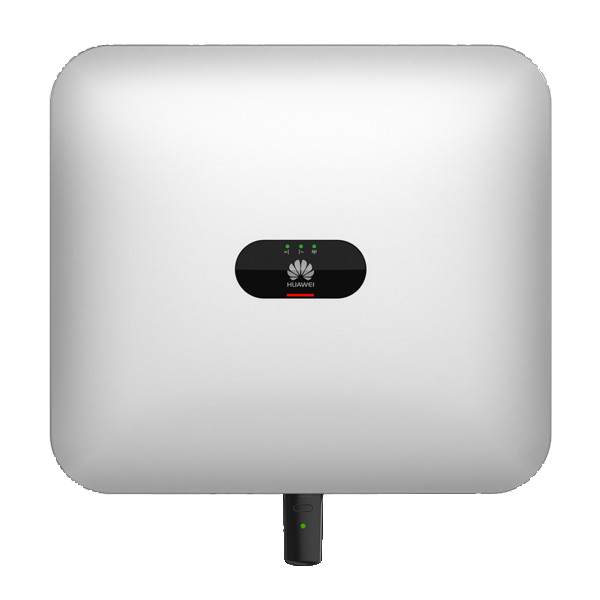

# ioBroker.sun2000-modbus

**Tests:** 

## Huawei SUN2000 inverter adapter for ioBroker

Read data from Huawei SUN2000 inverter and LUNA2000 Storage using Modbus TCP.

## Changelog

### **WORK IN PROGRESS**
* (daolis) initial release

## License
MIT License

Copyright (c) 2023 daolis <stephan.bechter@gmail.com>
